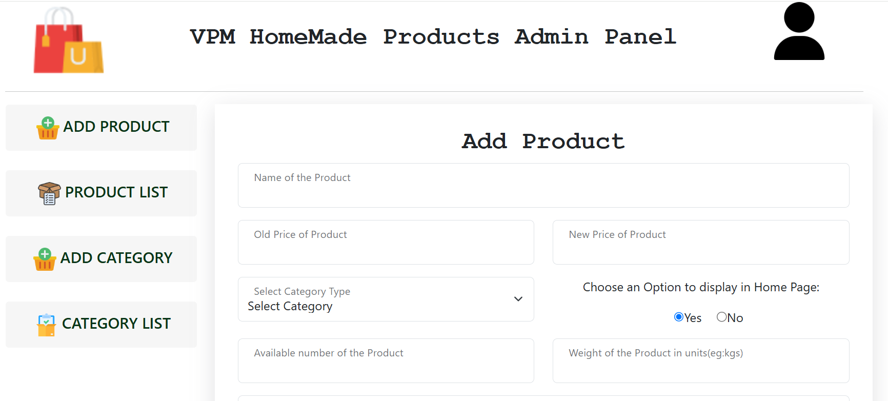

# 🛍️ E-Commerce Site for Homemade Products

A full-stack E-Commerce web application built using **ReactJS** for the frontend and **NodeJS** with **Express** for the backend. This platform is designed to showcase and sell handmade/home-based products with a seamless shopping experience.

---

## 🚀 Features

- 🏠 Home page with featured products
- 🔍 Product listing with filters and categories
- 📦 Product details and image gallery
- 🛒 Shopping cart with quantity management
- 🔐 User authentication and authorization
- 📦 Order tracking and history
- 🧑 Admin dashboard for product & order management
- 📱 Fully responsive design for mobile, tablet, and desktop

---

## 🛠️ Tech Stack

### Frontend:
- ReactJS
- React Router
- Axios
- Bootstrap 

### Backend:
- Node.js
- Express.js
- JWT for Authentication

---

## 📦 Installation & Setup

### 1. Clone the Repository

```bash
git clone https://github.com/<your-username>/homemade-products-store.git
cd homemade-products-store
```
### 2. Frontend Setup
```bash
cd frontend
npm install
npm run dev -- --port 5173

```
Runs React frontend on: http://localhost:5173

### 3. Backend Setup
```bash
cd backend
npm install
node index.js

```
Runs backend on: http://localhost:5000
### 2. Admin Setup
```bash
cd admin
npm install
npm run dev -- --port 5174

```
Runs React admin on: http://localhost:5174


## 🖼️ Screenshots

### 🔐 Frontend Page


### 🧑‍💻 Admin Page



---